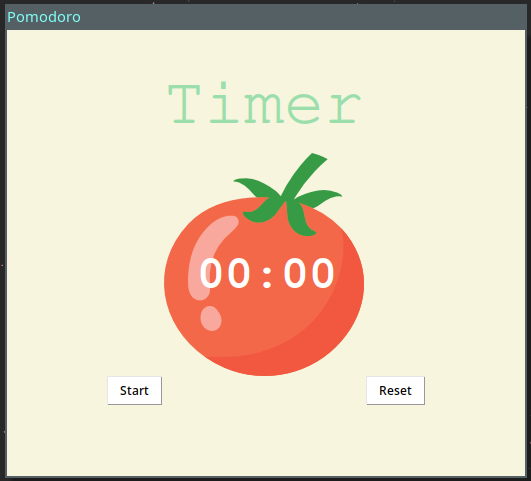

# Pomodoro-Timer-GUI-App
## Pomodoro GUI Application made in Python with tkinter

The **Pomodoro Technique** is a time management method developed by Francesco Cirillo in the late 1980s. It uses a kitchen timer to break work into intervals, typically 25 minutes in length, separated by short breaks. Each interval is known as a pomodoro, from the Italian word for tomato, after the tomato-shaped kitchen timer Cirillo used as a university student. (source : [Wikipedia](https://en.wikipedia.org/wiki/Pomodoro_Technique))

